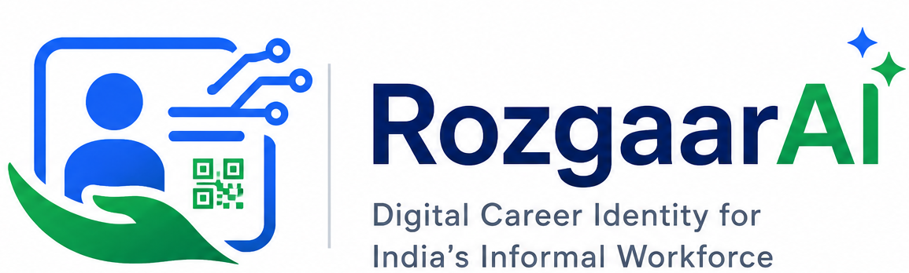
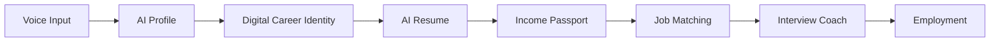
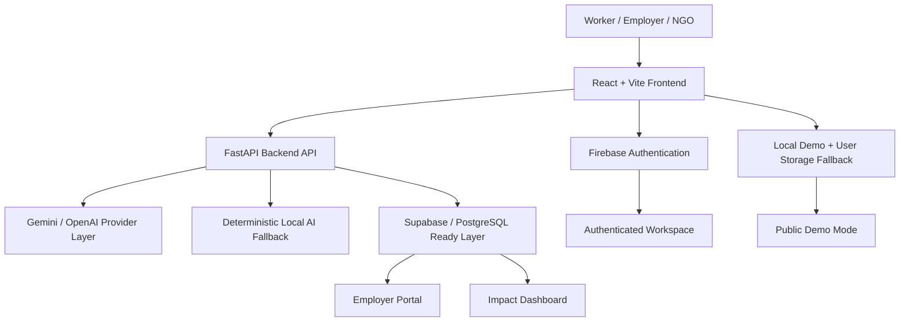
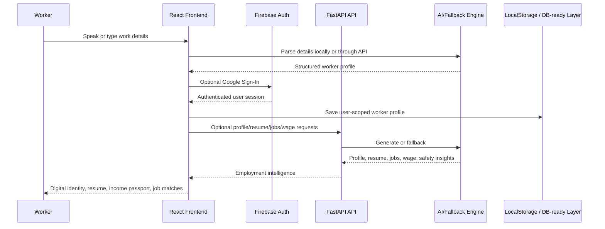
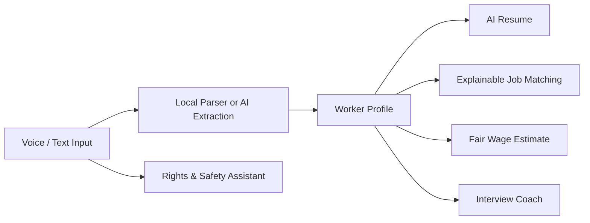

<p align="center">
  
</p>

<h1 align="center">RozgaarAI</h1>

<p align="center">
  <strong>Digital Career Identity & Income Passport for India's Informal Workforce</strong>
</p>

<p align="center">
  Turning spoken work experience into trusted employment.
</p>

<p align="center">
  <a href="https://github.com/Sam-wan30/RozgaarAI">
    
  </a>
  
  
  
  
  
  
  
</p>

<p align="center">
  <a href="https://rozgaar-ai-weld.vercel.app/"><strong>Live Demo</strong></a>
  ·
  <a href="https://youtu.be/0cf03Kmxwoc?si=QvkaBHMBraieyF-Y"><strong>Demo Video</strong></a>
  ·
  <a href="./DEPLOYMENT.md"><strong>Documentation</strong></a>
</p>

---

## Table Of Contents

- [Product Preview](#product-preview)
- [About RozgaarAI](#about-rozgaarai)
- [Key Features](#key-features)
- [Complete Product Flow](#complete-product-flow)
- [System Architecture](#system-architecture)
- [Tech Stack](#tech-stack)
- [Project Structure](#project-structure)
- [Installation](#installation)
- [Environment Variables](#environment-variables)
- [Deployment](#deployment)
- [AI Features](#ai-features)
- [Security](#security)
- [Performance](#performance)
- [Future Roadmap](#future-roadmap)
- [Build For Good](#build-for-good)
- [Contributing](#contributing)
- [License](#license)
- [Acknowledgements](#acknowledgements)

---

## About RozgaarAI

India's informal workforce powers homes, construction sites, transport networks, local businesses, housing societies, and urban services. Yet millions of skilled workers remain excluded from formal digital employment systems because their experience is difficult to verify, package, and share.

RozgaarAI is a voice-first AI employment platform that turns real-world work experience into a trusted digital career identity, income passport, professional resume, safer job opportunities, and interview readiness.

### The Problem

| Challenge | Real-World Consequence |
| --- | --- |
| No verified identity | Workers cannot prove skills, availability, or trustworthiness beyond word of mouth. |
| No formal resume | Employers struggle to evaluate practical experience quickly. |
| No income proof | Workers cannot demonstrate financial consistency to employers, NGOs, or financial partners. |
| Low interview confidence | Workers know the job but may struggle to present themselves clearly. |
| Unsafe job offers | Fake recruiters exploit workers through registration fees, missing addresses, and document misuse. |
| Language barriers | English-first job systems exclude workers who are more comfortable in Hindi or regional languages. |

### The RozgaarAI Solution

| Worker Need | RozgaarAI Response |
| --- | --- |
| Speak instead of typing | Voice/text onboarding extracts worker details from natural Hindi or English. |
| Prove work identity | Digital Career Identity with QR-linked public profile and verified worker ID. |
| Share professional profile | AI-generated resume and downloadable Digital Worker Card. |
| Build economic credibility | Work & Income Passport records daily wage, payment history, and verified work records. |
| Find safer jobs | Explainable job matching with employer trust and safety signals. |
| Prepare for interviews | AI Interview Coach gives role-specific practice and feedback. |
| Avoid fraud | AI Rights & Safety Assistant analyzes job offers and WhatsApp messages for scam indicators. |

---

## Key Features

| Feature | Problem | Solution | User Benefit |
| --- | --- | --- | --- |
| Voice AI Onboarding | Forms are difficult for low-literacy or first-time digital users. | Workers speak naturally in Hindi or English; AI/local parsing extracts profile data. | Faster onboarding with less typing. |
| Digital Career Identity | Informal skills are invisible and hard to verify. | Premium credential card with worker ID, QR, verification badge, skills, and readiness. | Portable trust signal for employers and NGOs. |
| AI Resume Generator | Workers lack employer-ready resumes. | Converts real experience into a structured, professional resume preview and download. | Workers can apply with confidence. |
| Work & Income Passport | Wage history is fragmented and informal. | Tracks work records, income, pending payments, and downloadable proof. | Builds economic credibility. |
| Explainable Job Matching | Job recommendations often feel opaque. | Shows why jobs match across skill, wage, location, language, safety, and experience. | Workers understand and trust recommendations. |
| AI Interview Coach | Workers may not know how to present experience. | Role-specific questions, voice/text answers, scoring, feedback, and improved answers. | Better interview readiness. |
| Rights & Safety Assistant | Fraudulent job messages are common. | Detects registration fees, missing employer identity, document risks, and suspicious contact patterns. | Safer decisions before accepting work. |
| Employer Dashboard | Employers struggle to discover verified informal workers. | Search, filter, view profiles, shortlist, and contact demo workers. | Faster, safer hiring workflow. |
| Impact Dashboard | NGOs need outcome visibility. | Tracks worker registrations, wage uplift, interviews, skill cards, and income unlocked. | Better program measurement. |
| Fair Wage Estimator | Workers negotiate without market benchmarks. | Estimates fair wages using skill, city, and experience. | Stronger wage confidence. |
| Google Authentication | Production users need secure workspace access. | Firebase Google Auth with persisted sessions and user-scoped local storage fallback. | Personal dashboard and saved worker profiles. |

---

## Complete Product Flow



### Judge Walkthrough

| Step | Experience | What To Show |
| --- | --- | --- |
| 1 | Explore demo worker | Open a complete worker journey instantly. |
| 2 | Create profile | Speak or type worker details; generate AI profile. |
| 3 | View identity | Show Digital Career Identity, QR, worker ID, readiness, and quick actions. |
| 4 | Download assets | Download resume and Digital Worker Card. |
| 5 | Review income proof | Open Work & Income Passport. |
| 6 | Match jobs | Explain why AI recommended each job. |
| 7 | Practice interview | Score an answer and show AI improvement. |
| 8 | Check safety | Paste risky WhatsApp job message and show safety report. |
| 9 | Employer view | Search and shortlist verified workers. |

---

## System Architecture



### Request Flow



---

## Tech Stack

| Category | Technology |
| --- | --- |
| Frontend | React 18, Vite 6, Tailwind CSS |
| UI System | Lucide React, custom responsive components, brand assets |
| Authentication | Firebase Authentication, Google Sign-In |
| QR / Export | `qrcode.react`, `html2canvas` |
| Backend | FastAPI, Pydantic, Uvicorn |
| AI Layer | Gemini-ready, OpenAI-ready, deterministic local fallback |
| Data | JSON mock data, localStorage user scopes, Supabase/PostgreSQL-ready architecture |
| Deployment | Vercel frontend, Render backend, Firebase Auth |
| Languages | JavaScript, Python |
| Tooling | ESLint, PostCSS, Tailwind, Vite build pipeline |

---

## Project Structure

```text
RozgaarAI
├── backend/
│   ├── app/
│   │   ├── data/
│   │   │   └── jobs.json
│   │   ├── services/
│   │   │   ├── ai.py
│   │   │   └── mock_engine.py
│   │   ├── main.py
│   │   └── models.py
│   ├── .python-version
│   ├── .env.example
│   └── requirements.txt
├── docs/
│   └── screenshots/
├── frontend/
│   ├── public/
│   ├── src/
│   │   ├── assets/
│   │   ├── components/
│   │   │   ├── DigitalCareerIdentityCard.jsx
│   │   │   ├── MetricCard.jsx
│   │   │   └── Section.jsx
│   │   ├── data/
│   │   │   └── mockData.js
│   │   ├── i18n/
│   │   │   ├── en.json
│   │   │   ├── hi.json
│   │   │   └── translations.js
│   │   ├── lib/
│   │   │   ├── api.js
│   │   │   ├── database.js
│   │   │   └── firebaseAuth.js
│   │   ├── App.jsx
│   │   ├── main.jsx
│   │   └── styles.css
│   ├── .env.example
│   ├── package.json
│   ├── vercel.json
│   └── vite.config.js
├── DEPLOYMENT.md
├── HACKATHON_SUBMISSION.md
├── render.yaml
├── vercel.json
└── README.md
```

| Path | Purpose |
| --- | --- |
| `frontend/src/App.jsx` | Main product shell, routes, dashboard, worker journey, landing page. |
| `frontend/src/components/` | Reusable product components, including the Digital Career Identity card. |
| `frontend/src/lib/api.js` | Frontend AI/API abstraction with demo-safe fallbacks. |
| `frontend/src/lib/firebaseAuth.js` | Firebase Google Auth configuration from environment variables. |
| `frontend/src/data/mockData.js` | Demo personas, local job data, income history, and fallback content. |
| `backend/app/main.py` | FastAPI routes for profile, resume, jobs, wages, safety, and interview logic. |
| `backend/app/services/` | AI service layer and deterministic fallback engine. |

---

## Installation

### Prerequisites

- Node.js 18+
- npm 9+
- Python 3.11 recommended for backend deployment parity
- Firebase project for Google Sign-In

### Clone

```bash
git clone https://github.com/Sam-wan30/RozgaarAI.git
cd RozgaarAI
```

### Frontend

```bash
cd frontend
npm install
cp .env.example .env
npm run dev
```

Frontend runs at:

```text
http://localhost:5173
```

### Backend

```bash
cd backend
python3 -m venv .venv
source .venv/bin/activate
pip install -r requirements.txt
uvicorn app.main:app --reload
```

Backend runs at:

```text
http://localhost:8000
```

### Build

```bash
cd frontend
npm run build
npm run preview
```

---

## Environment Variables

Never commit real `.env` files. Use `.env.example` for documentation and configure production secrets in Vercel/Render.

### Frontend `.env`

```bash
VITE_API_URL=http://localhost:8000
VITE_PUBLIC_APP_URL=http://localhost:5173
VITE_SUPABASE_URL=
VITE_SUPABASE_ANON_KEY=
VITE_FIREBASE_API_KEY=
VITE_FIREBASE_AUTH_DOMAIN=
VITE_FIREBASE_PROJECT_ID=
VITE_FIREBASE_STORAGE_BUCKET=
VITE_FIREBASE_MESSAGING_SENDER_ID=
VITE_FIREBASE_APP_ID=
```

### Backend `.env`

```bash
ALLOWED_ORIGINS=http://localhost:5173
OPENAI_API_KEY=
OPENAI_MODEL=gpt-4.1-mini
GEMINI_API_KEY=
SUPABASE_URL=
SUPABASE_ANON_KEY=
DATABASE_URL=
```

### Required For Google Sign-In

| Variable | Source |
| --- | --- |
| `VITE_FIREBASE_API_KEY` | Firebase project web app config |
| `VITE_FIREBASE_AUTH_DOMAIN` | Firebase project web app config |
| `VITE_FIREBASE_PROJECT_ID` | Firebase project web app config |
| `VITE_FIREBASE_STORAGE_BUCKET` | Firebase project web app config |
| `VITE_FIREBASE_MESSAGING_SENDER_ID` | Firebase project web app config |
| `VITE_FIREBASE_APP_ID` | Firebase project web app config |

---

## Deployment

Detailed deployment instructions live in [DEPLOYMENT.md](./DEPLOYMENT.md).

### Frontend: Vercel

Recommended Vercel settings:

```text
Root Directory: frontend
Framework Preset: Vite
Install Command: npm install
Build Command: npm run build
Output Directory: dist
```

SPA routing is handled by `frontend/vercel.json`:

```json
{
  "rewrites": [
    { "source": "/(.*)", "destination": "/" }
  ]
}
```

### Backend: Render

Recommended Render settings:

```text
Root Directory: backend
Runtime: Python 3
Build Command: pip install -r requirements.txt
Start Command: uvicorn app.main:app --host 0.0.0.0 --port $PORT
```

Set this environment variable on Render:

```bash
PYTHON_VERSION=3.11.9
```

### Firebase Auth

In Firebase Console:

1. Enable Google provider.
2. Add authorized domains:
   - `localhost`
   - your Vercel domain without `https://`
3. Do not add the Render backend domain. Google Sign-In happens in the browser on the Vercel frontend.

---

## AI Features

RozgaarAI is designed to be demo-safe without paid AI keys and production-ready when AI providers are configured.



| AI Capability | What It Does | Fallback Behavior |
| --- | --- | --- |
| Voice processing | Uses browser speech recognition where available. | Text input remains available. |
| Profile generation | Structures name, skill, city, experience, language, wage, and availability. | Local parser and deterministic profile generator. |
| Resume generation | Creates employer-ready summary and work sections. | Local resume templates by role. |
| Interview scoring | Scores answer clarity, confidence, technical relevance, and professionalism. | Deterministic scoring with role-specific feedback. |
| Rights analysis | Flags suspicious fees, missing address, document requests, WhatsApp-only contact. | Local scam signal rules. |
| Job matching | Scores roles by skill, city, wage, language, safety, and experience. | Mock jobs and transparent scoring engine. |
| Wage estimation | Estimates fair wage range from skill, city, and experience. | Local wage tables and role heuristics. |

---

## Security

| Area | Implementation |
| --- | --- |
| Authentication | Firebase Google Authentication with persisted browser sessions. |
| Config safety | Firebase values are read only from `import.meta.env`. Missing values warn gracefully. |
| Secrets | Real `.env` files are ignored by Git. Production secrets belong in Vercel/Render settings. |
| Route model | Public demo routes remain accessible; signed-in dashboards use user-scoped local storage. |
| Data separation | Demo profiles and authenticated user profiles are stored separately. |
| Backend CORS | Render backend accepts configured `ALLOWED_ORIGINS`. |

---

## Performance

- Vite production build with optimized static assets.
- `html2canvas` is dynamically imported only when downloading the Digital Worker Card.
- Responsive layouts across mobile, tablet, laptop, and desktop.
- Accessible form labels, focus states, semantic buttons, and readable contrast.
- Local fallback logic avoids hard failures when AI, database, backend, or speech APIs are unavailable.
- Deployment-ready SPA rewrites for route refreshes on Vercel.

---

## Future Roadmap

| Phase | Roadmap Item |
| --- | --- |
| Language Access | Expand to Marathi, Bengali, Tamil, Telugu, Kannada, and voice prompts. |
| Employer Trust | Verified employer onboarding, abuse reporting, and hiring history. |
| Government Integration | DPI-style integrations with skilling programs, DigiLocker-style credentials, and public employment initiatives. |
| Financial Services | Income history export for microcredit, savings products, and partner verification. |
| Offline Mode | Field-worker mode for NGOs with sync-on-connect. |
| AI Career Advisor | Skill upgrade plans, local training recommendations, and career pathways. |
| Database Persistence | Supabase/PostgreSQL tables for production multi-user records. |
| Worker Privacy | Fine-grained profile sharing controls and consent-based employer access. |

---

## Build For Good

RozgaarAI aligns with Build for Good by applying AI to a high-impact public-interest problem: employability and economic dignity for India's informal workforce.

| Impact Area | RozgaarAI Contribution |
| --- | --- |
| Social impact | Helps workers convert practical skills into trusted digital credentials. |
| Digital inclusion | Voice-first onboarding lowers barriers for first-time digital users. |
| Employment | Improves job discovery, readiness, and employer trust. |
| Financial empowerment | Income Passport turns informal wage history into shareable economic proof. |
| Worker safety | AI Rights & Safety Assistant helps detect scams before harm occurs. |
| National scalability | Demo-safe architecture can expand through NGOs, employers, skilling partners, and government programs. |

> [!IMPORTANT]
> RozgaarAI is not just a job board. It is a digital public-service style employability layer that helps workers prove who they are, what they know, where they have worked, and what they deserve to earn.

---

## Contributing

RozgaarAI welcomes thoughtful contributions from engineers, designers, researchers, NGOs, skilling partners, and public-interest technologists.

### Good First Contributions

- Add regional language translations.
- Improve accessibility labels and keyboard navigation.
- Add screenshots to `docs/screenshots/`.
- Expand mock job data with realistic local wage ranges.
- Add backend tests for AI fallback engines.
- Improve README examples and deployment notes.

### Development Workflow

```bash
git checkout -b feature/your-feature-name
cd frontend
npm install
npm run dev
```

Before submitting:

```bash
cd frontend
npm run build
```

### Contribution Guidelines

- Keep demo mode reliable without paid APIs.
- Do not commit real environment variables.
- Preserve Hindi/English language support.
- Keep UI accessible and mobile-first.
- Prefer reusable components over one-off UI.
- Explain user impact in pull requests.

---

## License

RozgaarAI is released under the [MIT License](./LICENSE).

---

## Acknowledgements

RozgaarAI is inspired by India's Digital Public Infrastructure, worker-first social-impact platforms, DigiLocker-style digital credentials, modern AI copilots, and the everyday skill and resilience of India's informal workforce.

Built with React, Vite, Tailwind CSS, Firebase Authentication, FastAPI, QR code tooling, and AI-ready service abstractions.

---

<p align="center">
  <strong>Every worker deserves a trusted digital identity.</strong>
</p>

<p align="center">
  RozgaarAI transforms experience into opportunity.
</p>
