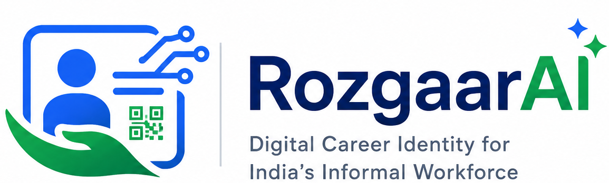
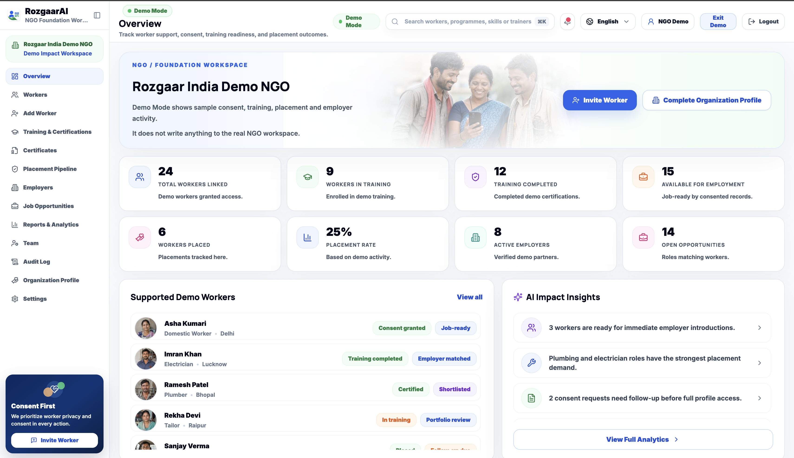
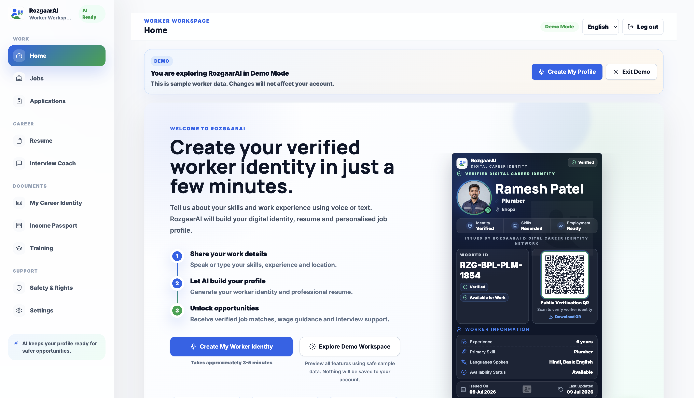
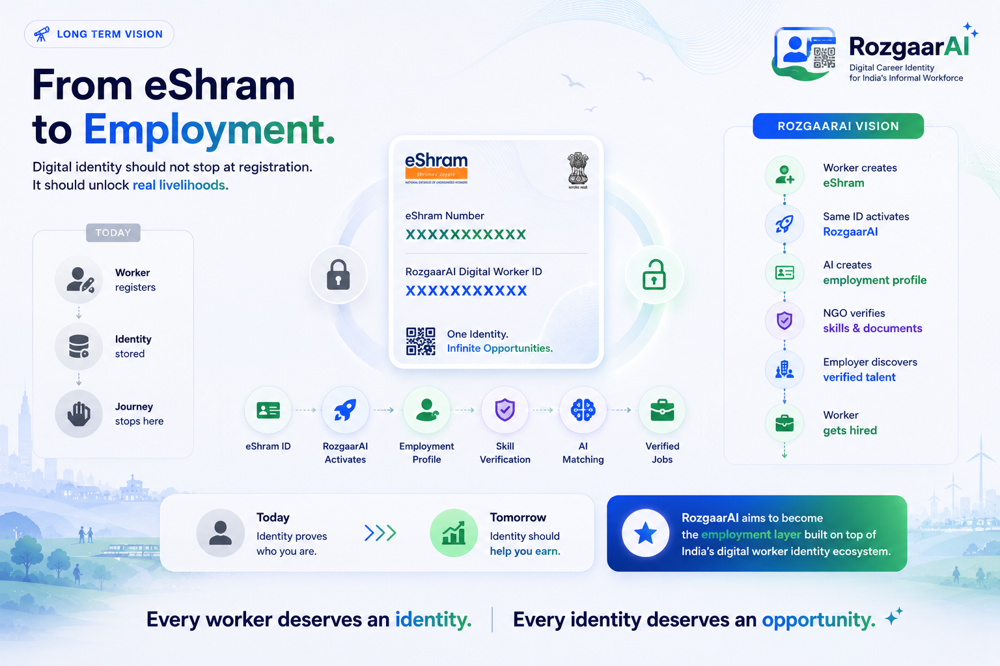
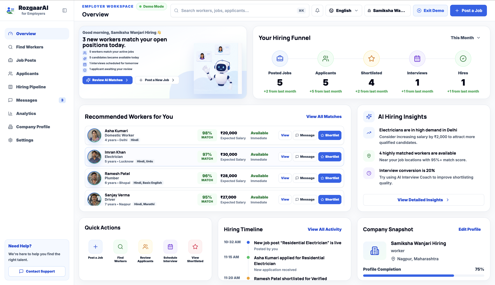
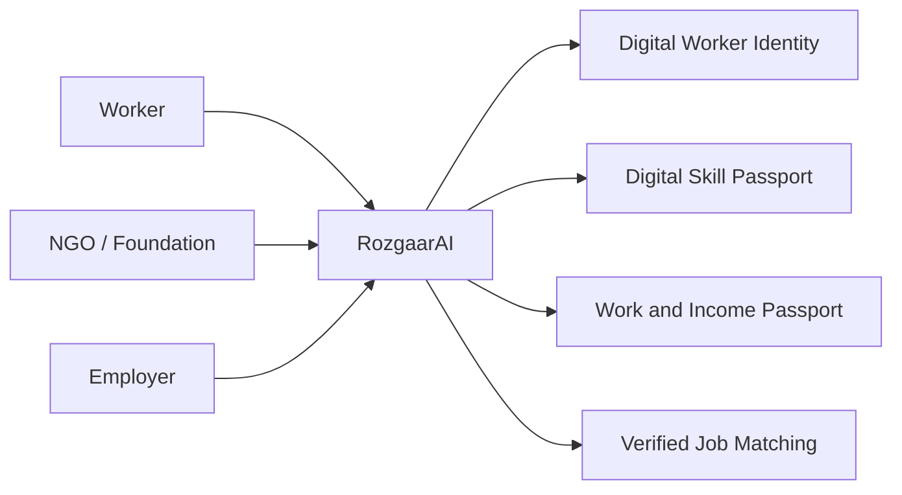
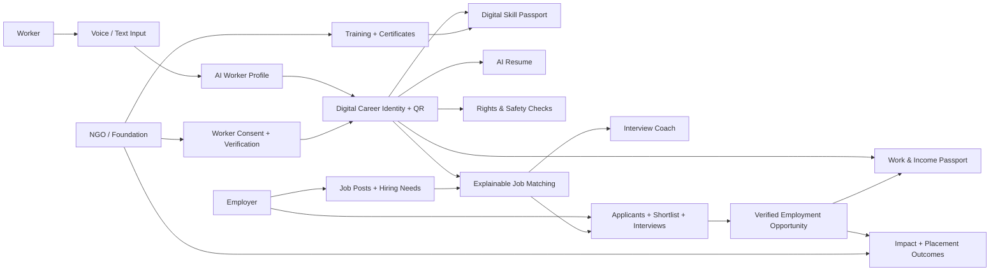
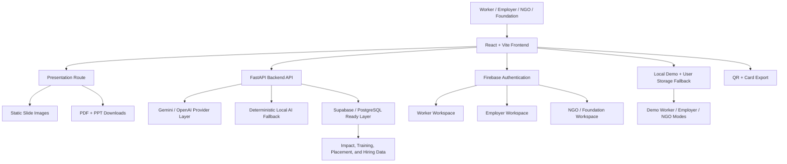
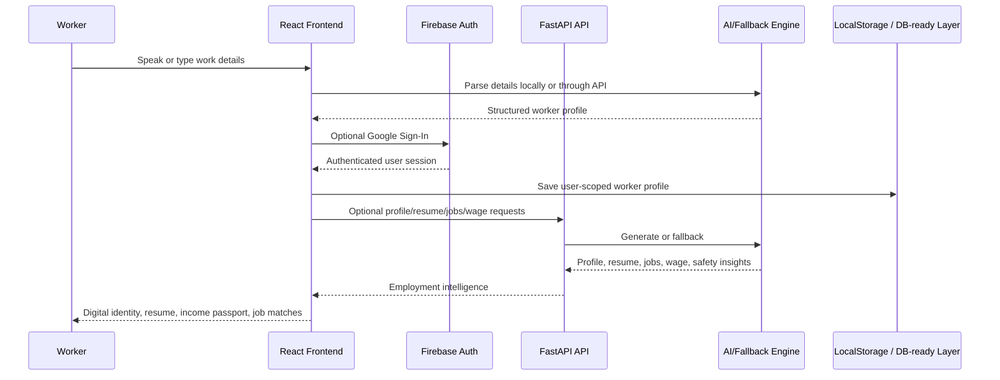
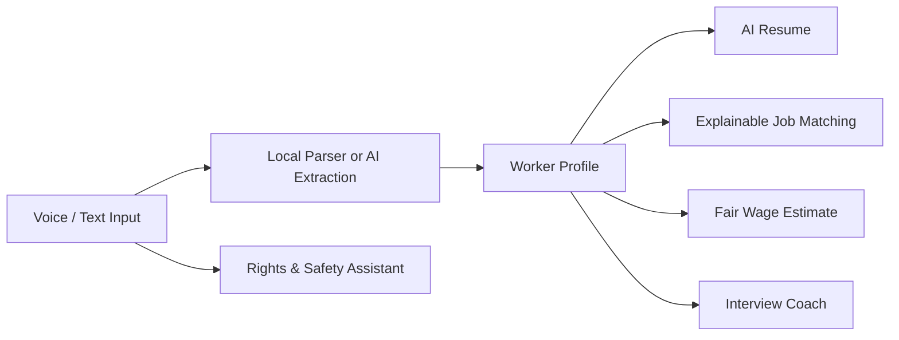

<div align="center">
  
  <h1>RozgaarAI</h1>
  <h3>Voice-first digital career identity and employment platform for India's informal workforce</h3>
  <p>
    <strong>Built for Sama Social | Build for Good Hackathon 2026</strong><br />
    <strong>Theme:</strong> Rozgaar
  </p>
</div>

<p align="center">
  <a href="https://rozgaar-ai-weld.vercel.app/">
    
  </a>
  <a href="https://rozgaar-ai-weld.vercel.app/presentation">
    
  </a>
  <a href="https://youtu.be/0cf03Kmxwoc?si=QvkaBHMBraieyF-Y">
    
  </a>
  <a href="./DEPLOYMENT.md">
    
  </a>
</p>

<p align="center">
  
  
  
  
  
  
  
  
</p>

<p align="center">
  
  
  
  
  
  
</p>

<p align="center">
  <a href="https://rozgaar-ai-weld.vercel.app/"><strong>Live Application</strong></a>
  &nbsp;|&nbsp;
  <a href="https://rozgaar-ai-weld.vercel.app/presentation"><strong>Interactive Presentation</strong></a>
  &nbsp;|&nbsp;
  <a href="https://rozgaar-ai-weld.vercel.app/demo"><strong>Worker Demo</strong></a>
  &nbsp;|&nbsp;
  <a href="https://rozgaar-ai-weld.vercel.app/ngo?demo=ngo"><strong>NGO Demo</strong></a>
  &nbsp;|&nbsp;
  <a href="https://rozgaar-ai-weld.vercel.app/employer?demo=true"><strong>Employer Demo</strong></a>
</p>

<p align="center">
  RozgaarAI turns spoken work experience into a trusted digital identity, skill passport, income proof, safer job discovery, and partner-ready employment workflows for workers, NGOs, foundations, and employers.
</p>

---

## Table Of Contents

- [Product Preview](#product-preview)
- [Feature Overview](#feature-overview)
- [Stakeholder Colour System](#stakeholder-colour-system)
- [About RozgaarAI](#about-rozgaarai)
- [Key Features](#key-features)
- [Core Workspaces](#core-workspaces)
- [Demo Experience](#demo-experience)
- [Interactive Presentation](#interactive-presentation)
- [UI & UX Improvements](#ui--ux-improvements)
- [Complete Product Flow](#complete-product-flow)
- [System Architecture](#system-architecture)
- [Tech Stack](#tech-stack)
- [Project Structure](#project-structure)
- [Routes](#routes)
- [Installation](#installation)
- [Environment Variables](#environment-variables)
- [Deployment](#deployment)
- [Phase 7 Production Readiness](#phase-7-production-readiness)
- [AI Features](#ai-features)
- [Security](#security)
- [Performance](#performance)
- [Future Roadmap](#future-roadmap)
- [Build For Good](#build-for-good)
- [Contributing](#contributing)
- [License](#license)
- [Acknowledgements](#acknowledgements)

---

## Product Preview

<p>
  
</p>

The repository includes production presentation assets under `frontend/public/presentation/slides/` and downloadable deck files under `frontend/public/downloads/`.

<table>
  <tr>
    <td width="50%" align="center">
      
      <br />
      <b>NGO and Foundation Workspace</b>
    </td>
    <td width="50%" align="center">
      
      <br />
      <b>Worker Workspace Preview</b>
    </td>
  </tr>
  <tr>
    <td width="50%" align="center">
      
      <br />
      <b>Long-Term Employment Vision</b>
    </td>
    <td width="50%" align="center">
      
      <br />
      <b>Employer Workspace Preview</b>
    </td>
  </tr>
</table>

Workspace previews are stored in `docs/screenshots/`, while the long-term vision slide remains loaded from `frontend/public/presentation/slides/`.

---

## Feature Overview

<p>
  
</p>

<table>
  <tr>
    <td width="25%">
      <b>Worker</b><br />
      <br />
      Voice-first onboarding, Digital Worker ID, QR sharing, resume, income passport, job matches, interview coach, and safety checks.
    </td>
    <td width="25%">
      <b>NGO / Foundation</b><br />
      <br />
      Worker linking, consent, assisted onboarding, training, certificates, placement pipeline, follow-ups, and impact reporting.
    </td>
    <td width="25%">
      <b>Employer</b><br />
      <br />
      Verified worker discovery, job posting, candidate profiles, shortlist, interviews, hiring pipeline, and demo company workflows.
    </td>
    <td width="25%">
      <b>Platform</b><br />
      <br />
      React/Vite SPA, Firebase Auth, FastAPI-ready backend, AI fallback layer, in-app pitch deck, PDF/PPT downloads, and Vercel deployment.
    </td>
  </tr>
</table>

> [!IMPORTANT]
> RozgaarAI's core differentiator is trust orchestration. It connects worker identity, NGO verification, employer discovery, training records, income proof, and job readiness into one employment journey.

---

## Stakeholder Colour System

<p>
  
</p>

| Stakeholder | Colour Role | Product Promise |
| --- | --- | --- |
|  | Deep blue | Give every worker a portable digital career identity. |
|  | Teal | Help trusted field partners verify, train, and track outcomes. |
|  | Green | Help employers discover reliable, job-ready workers. |
|  | Dark neutral | Connect identity, skills, jobs, safety, and impact data. |


```mermaid
flowchart LR
  W["Worker"] --> R["RozgaarAI"]
  N["NGO / Foundation"] --> R
  E["Employer"] --> R
  R --> ID["Digital Worker Identity"]
  R --> SP["Digital Skill Passport"]
  R --> IP["Work and Income Passport"]
  R --> JM["Verified Job Matching"]
```

---

## About RozgaarAI

<p>
  
</p>

India's informal workforce powers homes, construction sites, transport networks, local businesses, housing societies, and urban services. Yet millions of skilled workers remain excluded from formal digital employment systems because their experience is difficult to verify, package, and share.

RozgaarAI is a voice-first AI employment platform that turns real-world work experience into a trusted digital career identity, income passport, professional resume, safer job opportunities, and interview readiness.

### The Problem

| Challenge | Real-World Consequence |
| --- | --- |
| No verified identity | Workers cannot prove skills, availability, or trustworthiness beyond word of mouth. |
| No formal resume | Employers struggle to evaluate practical experience quickly. |
| No income proof | Workers cannot demonstrate financial consistency to employers, NGOs, or financial partners. |
| Low interview confidence | Workers know the job but may struggle to present themselves clearly. |
| Unsafe job offers | Fake recruiters exploit workers through registration fees, missing addresses, and document misuse. |
| Language barriers | English-first job systems exclude workers who are more comfortable in Hindi or regional languages. |

### The RozgaarAI Solution

| Worker Need | RozgaarAI Response |
| --- | --- |
| Speak instead of typing | Voice/text onboarding extracts worker details from natural Hindi or English. |
| Prove work identity | Digital Career Identity with QR-linked public profile and verified worker ID. |
| Share professional profile | AI-generated resume and downloadable Digital Worker Card. |
| Build economic credibility | Work & Income Passport records daily wage, payment history, and verified work records. |
| Get verified support | NGO/Foundation workspace links workers, manages consent, adds training, verifies certificates, and tracks placement outcomes. |
| Reach trusted employers | Employer workspace discovers verified workers, posts jobs, manages applicants, and tracks hiring pipeline movement. |
| Find safer jobs | Explainable job matching with employer trust and safety signals. |
| Prepare for interviews | AI Interview Coach gives role-specific practice and feedback. |
| Avoid fraud | AI Rights & Safety Assistant analyzes job offers and WhatsApp messages for scam indicators. |
| Present the ecosystem | Interactive `/presentation` route ships the latest 15-slide pitch deck with PDF and PPT downloads. |

---

## Key Features

<p>
  
</p>

| Feature | Problem | Solution | User Benefit |
| --- | --- | --- | --- |
|  | Forms are difficult for low-literacy or first-time digital users. | Workers speak naturally in Hindi or English; AI/local parsing extracts profile data. | Faster onboarding with less typing. |
|  | Informal skills are invisible and hard to verify. | Premium credential card with worker ID, QR, verification badge, skills, and readiness. | Portable trust signal for employers and NGOs. |
|  | Worker information is hard to share safely across organizations. | QR-enabled Digital Worker ID opens the worker's public/shareable profile when profile sharing is enabled. | Employers and NGOs can review trusted worker context faster. |
|  | Workers lack employer-ready resumes. | Converts real experience into a structured, professional resume preview and download. | Workers can apply with confidence. |
|  | Training and skill verification are scattered across programmes. | Worker identity and NGO training/certificate records create a portable skill history. | Workers carry readiness proof across opportunities. |
|  | Wage history is fragmented and informal. | Tracks work records, income, pending payments, and downloadable proof. | Builds economic credibility. |
|  | Job recommendations often feel opaque. | Shows why jobs match across skill, wage, location, language, safety, and experience. | Workers understand and trust recommendations. |
|  | Workers may not know how to present experience. | Role-specific questions, voice/text answers, scoring, feedback, and improved answers. | Better interview readiness. |
|  | Fraudulent job messages are common. | Detects registration fees, missing employer identity, document risks, and suspicious contact patterns. | Safer decisions before accepting work. |
|  | Employers struggle to discover verified informal workers. | Search, filter, view profiles, shortlist, and contact demo workers. | Faster, safer hiring workflow. |
|  | NGOs need field workflows, consent visibility, training records, and placement tracking. | Organization workspace for worker linking, assisted onboarding, training, certificates, employers, jobs, pipeline, reports, team, audit, and settings. | Better program delivery and measurable outcomes. |
|  | NGOs need outcome visibility. | Tracks worker registrations, training, certificates, active employers, open opportunities, placements, and follow-ups. | Better program measurement. |
|  | Workers negotiate without market benchmarks. | Estimates fair wages using skill, city, and experience. | Stronger wage confidence. |
|  | Production users need secure workspace access. | Firebase Google Auth with persisted sessions and user-scoped local storage fallback. | Personal dashboard and saved worker profiles. |
|  | Judges need a complete product tour without setup friction. | Demo Worker, Employer, and NGO modes load sample identities, jobs, training, placement, and impact data. | Reliable walkthrough even without database or paid AI keys. |
|  | Pitch decks often get separated from the product. | `/presentation` renders the latest slide images with keyboard controls, overview, fullscreen, and PDF/PPT downloads. | A polished in-browser deck for demos and deployment. |
|  | Workers and partners use different devices and languages. | Responsive layouts, Hindi/English interface copy, accessible controls, and mobile-friendly dashboards. | Easier adoption across field, office, and demo contexts. |

---

## Core Workspaces

<p>
  
</p>

### Worker Workspace

- Voice/text onboarding for worker profile creation in Hindi or English.
- Digital Career Identity with worker ID, QR-linked profile, readiness signals, resume summary, income proof, and share controls.
- QR-enabled Digital Worker ID that opens the public/shareable worker profile when sharing is enabled.
- Worker dashboard routes for identity, job matches, income passport, training, resume, interview coach, rights and safety, applications, and settings.
- Public worker profile routes for sharing verified identity context with employers and support organizations.

### NGO / Foundation Workspace

- NGO onboarding, account creation flow, demo mode, and organization profile management.
- Linked worker management, invite flow, assisted onboarding, worker enrolment, worker details, profile assistance, and worker activity.
- Training programmes, programme dashboard, enrolment, attendance, assessments, readiness monitoring, certificates, certificate detail views, and worker progress tracking.
- Employer directory, job opportunities, worker recommendations, placement pipeline, interviews, follow-ups, placement reports, team management, audit log, and production settings.
- NGO/Foundation partners bridge trust between workers and employers by verifying identity, skills, documents, training progress, and placement outcomes before opportunities are unlocked.

### Employer Workspace

- Employer onboarding landing page, account creation flow, demo mode, and protected employer workspace.
- Overview dashboard with hiring funnel metrics, activity, recommended workers, quick actions, and company snapshot.
- Worker search, filters, comparison, candidate profile detail, public profile viewing, resume download, shortlist, contact, and interview scheduling.
- Job post list, new job form, job detail, applicants, hiring pipeline board, messages, analytics, company profile, demo company data, and settings.

---

## Demo Experience

<p>
  
</p>

RozgaarAI is built to run a complete demo without Supabase, backend persistence, login, or paid AI keys.

> [!NOTE]
> Demo routes are intentionally available without production database setup so judges can evaluate the full worker, NGO, and employer journey immediately.

> [!TIP]
> Start with the live application, open the interactive presentation, then compare the worker, NGO, and employer demo routes to see how one identity moves across the ecosystem.

| Demo Area | Route | What It Shows |
| --- | --- | --- |
| Public demo | `/demo` | Guided product tour with sample workers and role-based entry points. |
| Worker demo dashboard | `/demo/dashboard` | Digital identity, income passport, job matches, interview coach, safety checks, downloads, and applications. |
| Employer demo | `/employer` with demo mode | Sample employer jobs, workers, applications, shortlist, messages, analytics, and hiring pipeline. |
| NGO demo | `/ngo` with demo mode | NGO impact workspace with sample workers, training, certificates, employers, jobs, placements, and reports. |

---

## Interactive Presentation

<p>
  
</p>

The production pitch deck lives inside the React/Vite app at:

```text
/presentation
```

It renders 15 static slide images from `frontend/public/presentation/slides/` and keeps the PDF/PPT downloads available from `frontend/public/downloads/`.

| Capability | Implementation |
| --- | --- |
| Slide rendering | `frontend/src/presentation/SlideRenderer.jsx` uses the ordered slide data from `slidesData.js`. |
| Navigation | Previous/next controls, arrow navigation, bottom progress, overview modal, keyboard navigation, CSS transitions, and fullscreen support. |
| Downloads | PDF and PPT buttons link to `/downloads/RozgaarAI-Presentation.pdf` and `/downloads/RozgaarAI-Presentation.pptx`. |
| Direct refresh | Root `vercel.json` rewrites all SPA paths to `/index.html`, so `/presentation` can be opened or refreshed directly on Vercel. |
| Branding | Presentation navbar uses the compact RozgaarAI mark from `frontend/src/assets/brand/rozgaarai-navbar-logo.png`. |

---

## UI & UX Improvements

<p>
  
</p>

- Premium blue-green RozgaarAI design system with consistent brand assets and reduced visual clutter.
- Responsive layouts for mobile, tablet, laptop, and desktop.
- Improved worker, employer, and NGO dashboards with denser information, clearer navigation, and better task flows.
- More guided onboarding for workers, employers, and NGO/Foundation partners.
- Interactive cards, modals, filters, progress indicators, and workspace navigation.
- Modern motion and transitions in the product shell and presentation page.
- Improved accessibility through semantic buttons, labels, focus states, readable contrast, and mobile-friendly controls.

---

## Complete Product Flow

<p>
  
</p>


```mermaid
flowchart LR
  Worker["Worker"] --> Voice["Voice / Text Input"]
  Voice --> Profile["AI Worker Profile"]
  Profile --> Identity["Digital Career Identity + QR"]
  Identity --> Skill["Digital Skill Passport"]
  Identity --> Resume["AI Resume"]
  Identity --> Income["Work & Income Passport"]
  Identity --> Safety["Rights & Safety Checks"]
  Identity --> Jobs["Explainable Job Matching"]
  Jobs --> Coach["Interview Coach"]
  NGO["NGO / Foundation"] --> Consent["Worker Consent + Verification"]
  Consent --> Identity
  NGO --> Training["Training + Certificates"]
  Training --> Skill
  Employer["Employer"] --> Openings["Job Posts + Hiring Needs"]
  Openings --> Jobs
  Employer --> Pipeline["Applicants + Shortlist + Interviews"]
  Jobs --> Pipeline
  Pipeline --> Employment["Verified Employment Opportunity"]
  Employment --> Income
  Employment --> Impact["Impact + Placement Outcomes"]
  NGO --> Impact
```

### Judge Walkthrough

| Step | Experience | What To Show |
| --- | --- | --- |
| 1 | Explore demo worker | Open a complete worker journey instantly. |
| 2 | Create profile | Speak or type worker details; generate AI profile. |
| 3 | View identity | Show Digital Career Identity, QR, worker ID, readiness, and quick actions. |
| 4 | Download assets | Download resume and Digital Worker Card. |
| 5 | Review income proof | Open Work & Income Passport. |
| 6 | Match jobs | Explain why AI recommended each job. |
| 7 | Practice interview | Score an answer and show AI improvement. |
| 8 | Check safety | Paste risky WhatsApp job message and show safety report. |
| 9 | Employer view | Search workers, post jobs, shortlist candidates, and review the hiring pipeline. |
| 10 | NGO view | Open NGO demo mode to show worker linking, training, certificates, employers, jobs, placements, and impact reporting. |
| 11 | Presentation | Open `/presentation`, move through slides, open overview, and test PDF/PPT downloads. |

---

## System Architecture

<p>
  
</p>


```mermaid
flowchart TB
  U["Worker / Employer / NGO / Foundation"] --> FE["React + Vite Frontend"]
  FE --> PRES["Presentation Route"]
  PRES --> SLIDES["Static Slide Images"]
  PRES --> DOWNLOADS["PDF + PPT Downloads"]
  FE --> AUTH["Firebase Authentication"]
  FE --> API["FastAPI Backend API"]
  FE --> LOCAL["Local Demo + User Storage Fallback"]
  FE --> QR["QR + Card Export"]
  API --> AI["Gemini / OpenAI Provider Layer"]
  API --> MOCK["Deterministic Local AI Fallback"]
  API --> DB["Supabase / PostgreSQL Ready Layer"]
  AUTH --> WORKER["Worker Workspace"]
  AUTH --> EMP["Employer Workspace"]
  AUTH --> NGO["NGO / Foundation Workspace"]
  LOCAL --> DEMO["Demo Worker / Employer / NGO Modes"]
  DB --> IMP["Impact, Training, Placement, and Hiring Data"]
```

### Request Flow


```mermaid
sequenceDiagram
  participant Worker
  participant Frontend as React Frontend
  participant Auth as Firebase Auth
  participant API as FastAPI API
  participant AI as AI/Fallback Engine
  participant Store as LocalStorage / DB-ready Layer

  Worker->>Frontend: Speak or type work details
  Frontend->>AI: Parse details locally or through API
  AI-->>Frontend: Structured worker profile
  Frontend->>Auth: Optional Google Sign-In
  Auth-->>Frontend: Authenticated user session
  Frontend->>Store: Save user-scoped worker profile
  Frontend->>API: Optional profile/resume/jobs/wage requests
  API->>AI: Generate or fallback
  AI-->>API: Profile, resume, jobs, wage, safety insights
  API-->>Frontend: Employment intelligence
  Frontend-->>Worker: Digital identity, resume, income passport, job matches
```

---

## Tech Stack

<p>
  
</p>

| Category | Technology |
| --- | --- |
| Frontend | React 18, Vite 6, Tailwind CSS |
| UI System | Lucide React, Framer Motion, custom responsive components, brand assets |
| Authentication | Firebase Authentication, Google Sign-In |
| QR / Export | `qrcode.react`, `qrcode`, `html2canvas` |
| Backend | FastAPI, Pydantic, Uvicorn |
| AI Layer | Gemini-ready, OpenAI-ready, deterministic local fallback |
| Data | JSON mock data, localStorage user scopes, Supabase/PostgreSQL-ready architecture |
| Presentation | Static PNG slides, in-app React presentation shell, PDF and PPT download bundle |
| Deployment | Vercel frontend, Render backend, Firebase Auth |
| Languages | JavaScript, Python |
| Tooling | ESLint, PostCSS, Tailwind, Vite build pipeline |

## Phase 7 Production Readiness

<p>
  
</p>

Phase 7 deployment, QA, pilot and demo materials are available in:

- [Deployment Runbook](docs/DEPLOYMENT_PHASE_7.md)
- [QA Checklist](docs/QA_PHASE_7.md)
- [Pilot Guide](docs/PILOT_GUIDE.md)
- [Demo Guide](docs/DEMO_GUIDE.md)
- [Architecture Notes](docs/ARCHITECTURE_PHASE_7.md)
- [Project Completion Report](docs/PROJECT_COMPLETION_REPORT_PHASE_7.md)

Admin diagnostics are available at `/admin/diagnostics` for admin accounts. The page reports environment readiness without exposing secret values.

---

## Project Structure

<p>
  
</p>

<details>
<summary><b>View project structure</b></summary>

```text
RozgaarAI
├── backend/
│   ├── app/
│   │   ├── data/
│   │   │   └── jobs.json
│   │   ├── services/
│   │   │   ├── ai.py
│   │   │   └── mock_engine.py
│   │   ├── main.py
│   │   └── models.py
│   ├── .python-version
│   ├── .env.example
│   └── requirements.txt
├── docs/
│   └── screenshots/
├── frontend/
│   ├── public/
│   │   ├── downloads/
│   │   │   ├── RozgaarAI-Presentation.pdf
│   │   │   └── RozgaarAI-Presentation.pptx
│   │   └── presentation/
│   │       ├── sama-social-logo.png
│   │       └── slides/
│   ├── src/
│   │   ├── assets/
│   │   │   └── brand/
│   │   ├── components/
│   │   │   ├── admin/
│   │   │   ├── employer/
│   │   │   ├── ngo/
│   │   │   ├── worker/
│   │   │   ├── DigitalCareerIdentityCard.jsx
│   │   │   ├── MetricCard.jsx
│   │   │   └── Section.jsx
│   │   ├── data/
│   │   │   └── mockData.js
│   │   ├── i18n/
│   │   │   ├── en.json
│   │   │   ├── hi.json
│   │   │   └── translations.js
│   │   ├── lib/
│   │   │   ├── api.js
│   │   │   ├── database.js
│   │   │   ├── firebaseAuth.js
│   │   │   └── routeGuards.js
│   │   ├── presentation/
│   │   │   ├── PresentationPage.jsx
│   │   │   ├── PresentationStage.jsx
│   │   │   ├── SlideRenderer.jsx
│   │   │   ├── slidesData.js
│   │   │   └── presentation.css
│   │   ├── App.jsx
│   │   ├── main.jsx
│   │   └── styles.css
│   ├── .env.example
│   ├── package.json
│   ├── vercel.json
│   └── vite.config.js
├── DEPLOYMENT.md
├── HACKATHON_SUBMISSION.md
├── render.yaml
├── vercel.json
└── README.md
```

| Path | Purpose |
| --- | --- |
| `frontend/src/App.jsx` | Main product shell, routes, dashboard, worker journey, landing page. |
| `frontend/src/components/` | Reusable product components, worker tools, employer workspace, NGO workspace, auth modal, and admin diagnostics. |
| `frontend/src/presentation/` | Interactive `/presentation` page, slide data, controls, overview, and presentation styling. |
| `frontend/public/presentation/` | Static presentation images and Sama Social logo used by the deck. |
| `frontend/public/downloads/` | Downloadable PDF and PPT deck files served by Vercel. |
| `frontend/src/lib/api.js` | Frontend AI/API abstraction with demo-safe fallbacks. |
| `frontend/src/lib/firebaseAuth.js` | Firebase Google Auth configuration from environment variables. |
| `frontend/src/lib/routeGuards.js` | Role-based route access rules for worker, employer, NGO, and admin workspaces. |
| `frontend/src/data/mockData.js` | Demo personas, local job data, income history, and fallback content. |
| `backend/app/main.py` | FastAPI routes for profile, resume, jobs, wages, safety, and interview logic. |
| `backend/app/services/` | AI service layer and deterministic fallback engine. |

</details>

---

## Routes

<p>
  
</p>

<details>
<summary><b>View route reference</b></summary>

| Route | Access | Purpose |
| --- | --- | --- |
| `/` | Public | Landing page and product overview. |
| `/presentation` | Public | Interactive 15-slide pitch deck with PDF and PPT downloads. |
| `/demo` | Public | Demo entry point for worker, employer, and NGO experiences. |
| `/demo/dashboard` and `/demo/dashboard/*` | Demo | Demo worker dashboard and worker tools. |
| `/login`, `/signup` | Public modal routes | Opens the authentication modal and returns to the intended route. |
| `/create-profile` | Worker | Voice/text worker onboarding and profile creation. |
| `/dashboard` and `/dashboard/*` | Worker | Worker workspace: home, identity, jobs, income, training, resume, coach, safety, applications, settings, and organization requests. |
| `/worker/:workerId` | Public/shareable | Digital worker identity, QR-linked profile, resume, income proof, job matches, coach, rights, and downloads. |
| `/public/:workerId`, `/profile/:workerId` | Public/shareable | Backward-compatible public worker profile routes. |
| `/employer/onboarding` | Public | Employer onboarding and demo entry. |
| `/employer` and `/employer/*` | Employer or demo mode | Employer overview, workers, job posts, applicants, pipeline, messages, analytics, company profile, and settings. |
| `/ngo/onboarding` | NGO setup | NGO/Foundation organization onboarding. |
| `/ngo` and `/ngo/*` | NGO or demo mode | NGO overview, workers, invitations, assisted onboarding, training, certificates, employers, jobs, placements, interviews, follow-ups, reports, team, audit, and settings. |
| `/admin/diagnostics` | Admin | Environment readiness diagnostics without exposing secret values. |

SPA refresh support is configured in both root `vercel.json` and `frontend/vercel.json` with rewrites to `/index.html`.

</details>

---

## Installation

<p>
  
</p>

<details>
<summary><b>View local setup instructions</b></summary>

### Prerequisites

- Node.js 18+
- npm 9+
- Python 3.11 recommended for backend deployment parity
- Firebase project for Google Sign-In

### Clone

```bash
git clone https://github.com/Sam-wan30/RozgaarAI.git
cd RozgaarAI
```

### Frontend

```bash
cd frontend
npm install
cp .env.example .env
npm run dev
```

Frontend runs at:

```text
http://localhost:5173
```

### Backend

```bash
cd backend
python3 -m venv .venv
source .venv/bin/activate
pip install -r requirements.txt
uvicorn app.main:app --reload
```

Backend runs at:

```text
http://localhost:8000
```

### Build

```bash
cd frontend
npm run build
npm run preview
```

</details>

---

## Environment Variables

<p>
  
</p>

<details>
<summary><b>View environment variable reference</b></summary>

Never commit real `.env` files. Use `.env.example` for documentation and configure production secrets in Vercel/Render.

### Frontend `.env`

```bash
VITE_APP_VERSION=0.1.0
VITE_BUILD_TIMESTAMP=local-dev
VITE_API_URL=http://localhost:8000
VITE_PUBLIC_APP_URL=http://localhost:5173
VITE_SUPABASE_URL=
VITE_SUPABASE_ANON_KEY=
VITE_FIREBASE_API_KEY=
VITE_FIREBASE_AUTH_DOMAIN=
VITE_FIREBASE_PROJECT_ID=
VITE_FIREBASE_STORAGE_BUCKET=
VITE_FIREBASE_MESSAGING_SENDER_ID=
VITE_FIREBASE_APP_ID=
```

### Backend `.env`

```bash
OPENAI_API_KEY=
OPENAI_MODEL=gpt-4.1-mini
GEMINI_API_KEY=
SUPABASE_URL=
SUPABASE_ANON_KEY=
DATABASE_URL=
ALLOWED_ORIGINS=http://localhost:5173
```

### Required For Google Sign-In

| Variable | Source |
| --- | --- |
| `VITE_FIREBASE_API_KEY` | Firebase project web app config |
| `VITE_FIREBASE_AUTH_DOMAIN` | Firebase project web app config |
| `VITE_FIREBASE_PROJECT_ID` | Firebase project web app config |
| `VITE_FIREBASE_STORAGE_BUCKET` | Firebase project web app config |
| `VITE_FIREBASE_MESSAGING_SENDER_ID` | Firebase project web app config |
| `VITE_FIREBASE_APP_ID` | Firebase project web app config |

</details>

---

## Deployment

<p>
  
</p>

<details>
<summary><b>View deployment notes</b></summary>

Detailed deployment instructions live in [DEPLOYMENT.md](./DEPLOYMENT.md).

### Frontend: Vercel

This repository currently includes a root `vercel.json`, so the existing Vercel project can build from the repository root:

```text
Root Directory: .
Framework Preset: Vite
Install Command: handled by build command
Build Command: cd frontend && npm ci && npm run build
Output Directory: frontend/dist
```

SPA routing is handled by the root `vercel.json`:

```json
{
  "buildCommand": "cd frontend && npm ci && npm run build",
  "outputDirectory": "frontend/dist",
  "framework": "vite",
  "rewrites": [
    { "source": "/(.*)", "destination": "/index.html" }
  ]
}
```

The same SPA rewrite is also present in `frontend/vercel.json` for frontend-root deployments. Preserve these rewrites so direct browser refreshes on `/presentation`, `/worker/:workerId`, `/employer/*`, `/ngo/*`, and dashboard routes do not return a Vercel 404.

Presentation download files are deployed as static public assets:

```text
frontend/public/downloads/RozgaarAI-Presentation.pdf
frontend/public/downloads/RozgaarAI-Presentation.pptx
```

### Backend: Render

Recommended Render settings:

```text
Root Directory: backend
Runtime: Python 3
Build Command: pip install -r requirements.txt
Start Command: uvicorn app.main:app --host 0.0.0.0 --port $PORT
```

Set this environment variable on Render:

```bash
PYTHON_VERSION=3.11.9
```

### Firebase Auth

In Firebase Console:

1. Enable Google provider.
2. Add authorized domains:
   - `localhost`
   - your Vercel domain without `https://`
3. Do not add the Render backend domain. Google Sign-In happens in the browser on the Vercel frontend.

</details>

---

## AI Features

<p>
  
</p>

RozgaarAI is designed to be demo-safe without paid AI keys and production-ready when AI providers are configured.

> [!WARNING]
> Prototype and demo modes use local storage, mock data, and deterministic AI fallbacks when production services are not configured. Production pilots should configure Firebase, backend origins, AI providers, and a persistent database layer.


```mermaid
flowchart LR
  INPUT["Voice / Text Input"] --> PARSE["Local Parser or AI Extraction"]
  PARSE --> PROFILE["Worker Profile"]
  PROFILE --> RESUME["AI Resume"]
  PROFILE --> JOBS["Explainable Job Matching"]
  PROFILE --> WAGE["Fair Wage Estimate"]
  PROFILE --> COACH["Interview Coach"]
  INPUT --> SAFETY["Rights & Safety Assistant"]
```

| AI Capability | What It Does | Fallback Behavior |
| --- | --- | --- |
| Voice processing | Uses browser speech recognition where available. | Text input remains available. |
| Profile generation | Structures name, skill, city, experience, language, wage, and availability. | Local parser and deterministic profile generator. |
| Resume generation | Creates employer-ready summary and work sections. | Local resume templates by role. |
| Interview scoring | Scores answer clarity, confidence, technical relevance, and professionalism. | Deterministic scoring with role-specific feedback. |
| Rights analysis | Flags suspicious fees, missing address, document requests, WhatsApp-only contact. | Local scam signal rules. |
| Job matching | Scores roles by skill, city, wage, language, safety, and experience. | Mock jobs and transparent scoring engine. |
| Wage estimation | Estimates fair wage range from skill, city, and experience. | Local wage tables and role heuristics. |

---

## Security

<p>
  
</p>

| Area | Implementation |
| --- | --- |
| Authentication | Firebase Google Authentication with persisted browser sessions. |
| Config safety | Firebase values are read only from `import.meta.env`. Missing values warn gracefully. |
| Secrets | Real `.env` files are ignored by Git. Production secrets belong in Vercel/Render settings. |
| Route model | Public demo routes remain accessible; signed-in dashboards use user-scoped local storage. |
| Data separation | Demo profiles and authenticated user profiles are stored separately. |
| Backend CORS | Render backend accepts configured `ALLOWED_ORIGINS`. |

---

## Performance

<p>
  
</p>

- Vite production build with optimized static assets.
- `html2canvas` is dynamically imported only when downloading the Digital Worker Card.
- Responsive layouts across mobile, tablet, laptop, and desktop.
- Accessible form labels, focus states, semantic buttons, and readable contrast.
- Local fallback logic avoids hard failures when AI, database, backend, or speech APIs are unavailable.
- Deployment-ready SPA rewrites for route refreshes on Vercel.

---

## Future Roadmap

<p>
  
</p>

| Phase | Roadmap Item |
| --- | --- |
| Language Access | Expand to Marathi, Bengali, Tamil, Telugu, Kannada, and voice prompts. |
| Employer Trust | Verified employer onboarding, abuse reporting, and hiring history. |
| Government Integration | DPI-style integrations with skilling programs, DigiLocker-style credentials, and public employment initiatives. |
| Financial Services | Income history export for microcredit, savings products, and partner verification. |
| Offline Mode | Field-worker mode for NGOs with sync-on-connect. |
| AI Career Advisor | Skill upgrade plans, local training recommendations, and career pathways. |
| Database Persistence | Supabase/PostgreSQL tables for production multi-user records. |
| Worker Privacy | Fine-grained profile sharing controls and consent-based employer access. |

---

## Build For Good

<p>
  
</p>

RozgaarAI aligns with Build for Good by applying AI to a high-impact public-interest problem: employability and economic dignity for India's informal workforce.

| Impact Area | RozgaarAI Contribution |
| --- | --- |
| Social impact | Helps workers convert practical skills into trusted digital credentials. |
| Digital inclusion | Voice-first onboarding lowers barriers for first-time digital users. |
| Employment | Improves job discovery, readiness, and employer trust. |
| Financial empowerment | Income Passport turns informal wage history into shareable economic proof. |
| Worker safety | AI Rights & Safety Assistant helps detect scams before harm occurs. |
| National scalability | Demo-safe architecture can expand through NGOs, employers, skilling partners, and government programs. |

> [!IMPORTANT]
> RozgaarAI is not just a job board. It is a digital public-service style employability layer that helps workers prove who they are, what they know, where they have worked, and what they deserve to earn.

---

## Contributing

RozgaarAI welcomes thoughtful contributions from engineers, designers, researchers, NGOs, skilling partners, and public-interest technologists.

### Good First Contributions

- Add regional language translations.
- Improve accessibility labels and keyboard navigation.
- Add screenshots to `docs/screenshots/`.
- Expand mock job data with realistic local wage ranges.
- Add backend tests for AI fallback engines.
- Improve README examples and deployment notes.

### Development Workflow

```bash
git checkout -b feature/your-feature-name
cd frontend
npm install
npm run dev
```

Before submitting:

```bash
cd frontend
npm run build
```

### Contribution Guidelines

- Keep demo mode reliable without paid APIs.
- Do not commit real environment variables.
- Preserve Hindi/English language support.
- Keep UI accessible and mobile-first.
- Prefer reusable components over one-off UI.
- Explain user impact in pull requests.

---

## License

RozgaarAI is released under the [MIT License](./LICENSE).

---

## Acknowledgements

RozgaarAI is inspired by India's Digital Public Infrastructure, worker-first social-impact platforms, DigiLocker-style digital credentials, modern AI copilots, and the everyday skill and resilience of India's informal workforce.

Built with React, Vite, Tailwind CSS, Firebase Authentication, FastAPI, QR code tooling, and AI-ready service abstractions.

---

<p align="center">
  <strong>Every worker deserves a trusted digital identity.</strong>
</p>

<p align="center">
  RozgaarAI transforms experience into opportunity.
</p>
