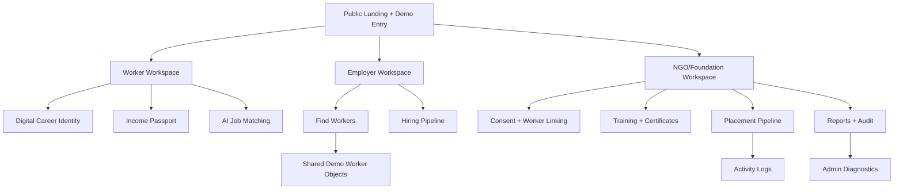
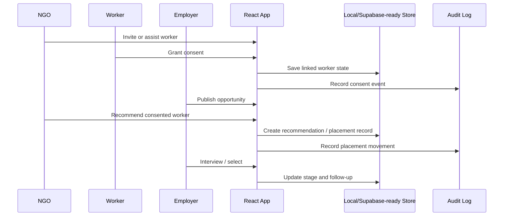

# RozgaarAI Architecture

## Core Principles

- Real data and demo overlays are isolated.
- Workers own identity and consent.
- Employers see verified, role-matched talent.
- NGOs support training, consent, and placement outcomes.
- Diagnostics expose configuration status without secrets.
